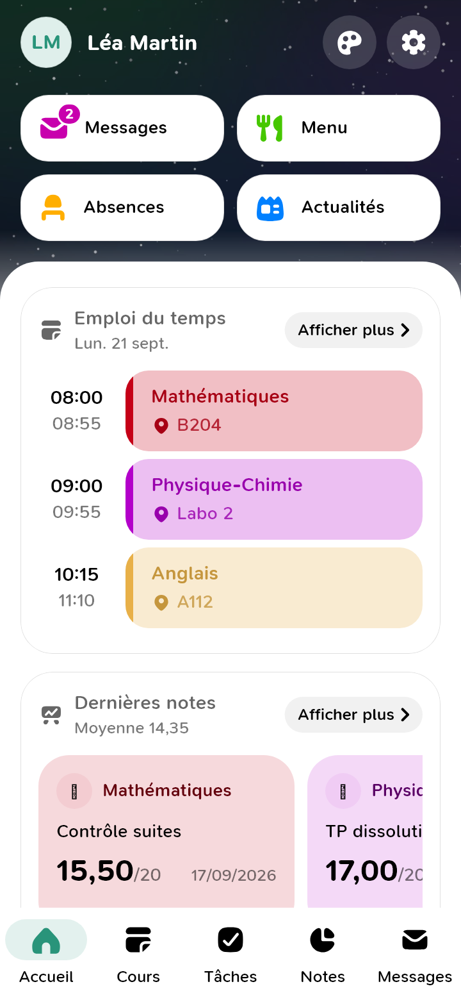
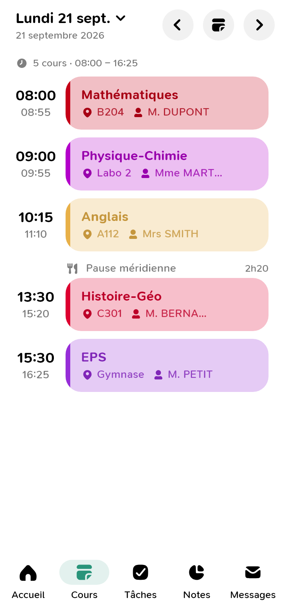
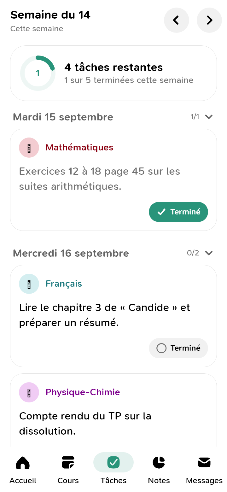
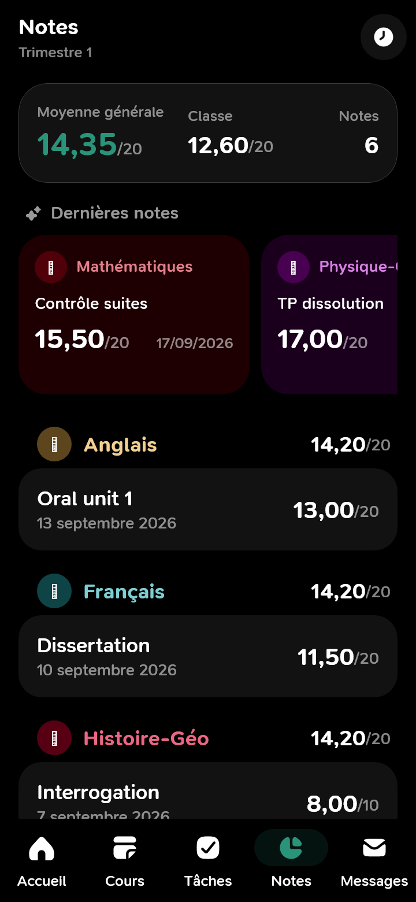
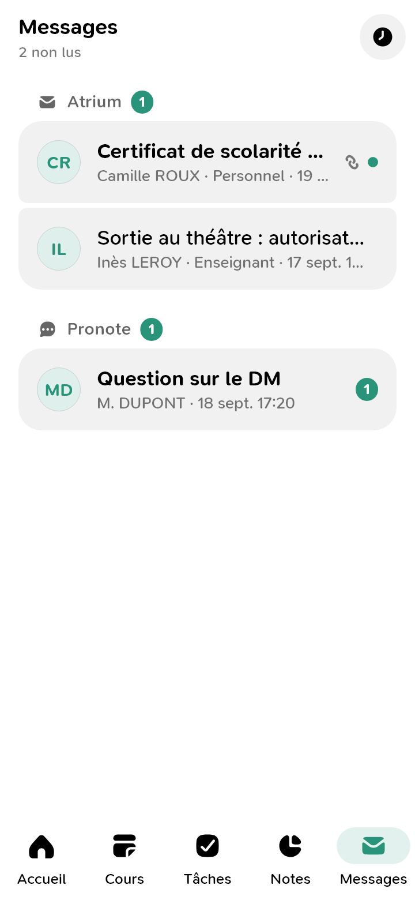
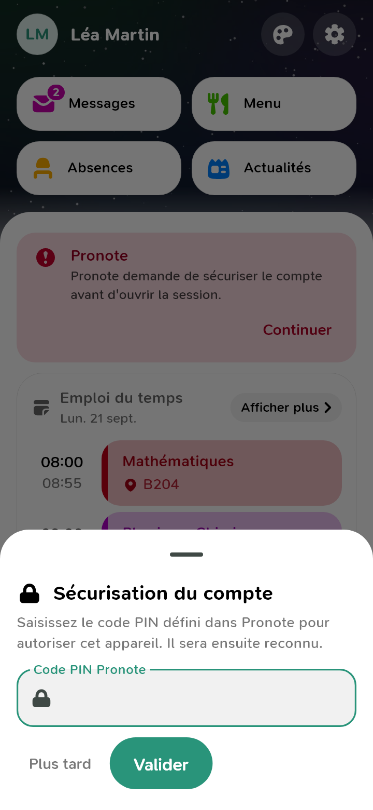
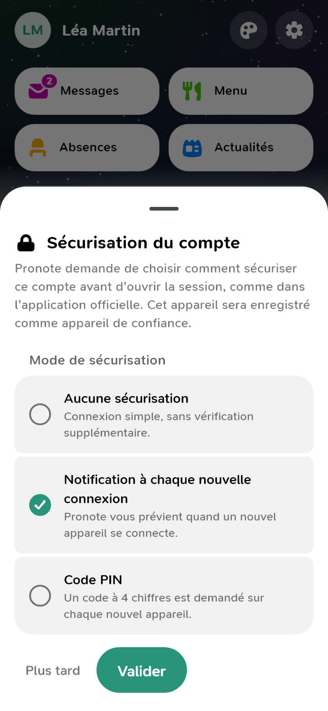

# Co-Saturnia

**Pronote et la messagerie Atrium dans une seule application, à la manière
de Papillon.**

Co-Saturnia est un client Pronote pour élèves, sur Windows et Android : emploi
du temps, travail à faire, notes, vie scolaire, actualités — et, dans le même
écran, la messagerie **Atrium** (l'ENT de la Région Sud), qu'il faut sinon
aller chercher dans un autre onglet.

---

## Aperçu

*Accueil : fond d'écran, boutons Messages / Menu / Absences / Actualités, prochains cours et dernières notes*

*Cours : un jour par page, cartes de cours et pauses*

*Tâches : la semaine, progression et pilule « Terminé »*

*Notes en mode sombre : moyennes, dernières notes, sections par matière*

*Messages : boîte Atrium et discussions Pronote*

*feuille « Sécurisation du compte » quand Pronote demande le code PIN*

*la même feuille quand Pronote demande de choisir le mode de sécurisation*

---

## Ce que ça fait

- **Accueil** — les prochains cours, les dernières notes, et quatre boutons :
  Messages, Menu, Absences, Actualités.
- **Cours** — un jour par page, avec la salle, le professeur et les pauses.
- **Tâches** — le travail à faire de la semaine, à cocher « Terminé » ; la
  progression se voit en tête.
- **Notes** — moyenne générale, moyenne de classe, dernières notes, puis le
  détail par matière.
- **Messages** — la boîte Atrium et les discussions Pronote au même endroit.
- **Mode clair ou sombre**, et un diagnostic dans les réglages qui dit ce qui
  a répondu et ce qui n'a pas répondu, service par service.

---

## Connexion et données

La connexion se fait **dans un navigateur intégré**, sur la page officielle
(ÉduConnect, profil Élève). Co-Saturnia ne voit pas et ne conserve pas votre
mot de passe : elle ne garde que les jetons de session que le service lui
remet, sur votre appareil, et les rejoue pour vous.

Aucun compte Co-Saturnia, aucun serveur intermédiaire, aucune publicité,
aucune donnée envoyée ailleurs qu'à Pronote et Atrium.

Co-Saturnia n'est pas une application officielle d'Index Éducation ni de la
Région Sud.

---

## Installation

- **Windows** : `cosaturnia-vX.Y.Z.exe`, installation dans votre profil, sans
  droit administrateur.
- **Android** : `cosaturnia-vX.Y.Z.apk`, Android 7.0 ou plus ; confirmez
  l'installation depuis une source extérieure.

Les versions sont publiées sur les [releases GitHub](../../releases) et dans
**Co-Menu**, la bibliothèque d'applications de Bicode_DEV, qui gère aussi les
mises à jour.

---

*Bicode_DEV — même famille que **Co-Menu**, **Co-Musique**, **Co-Craft**,
**Co-Santé**, **Co-Rappelle** et **Arcanum.block**.*
